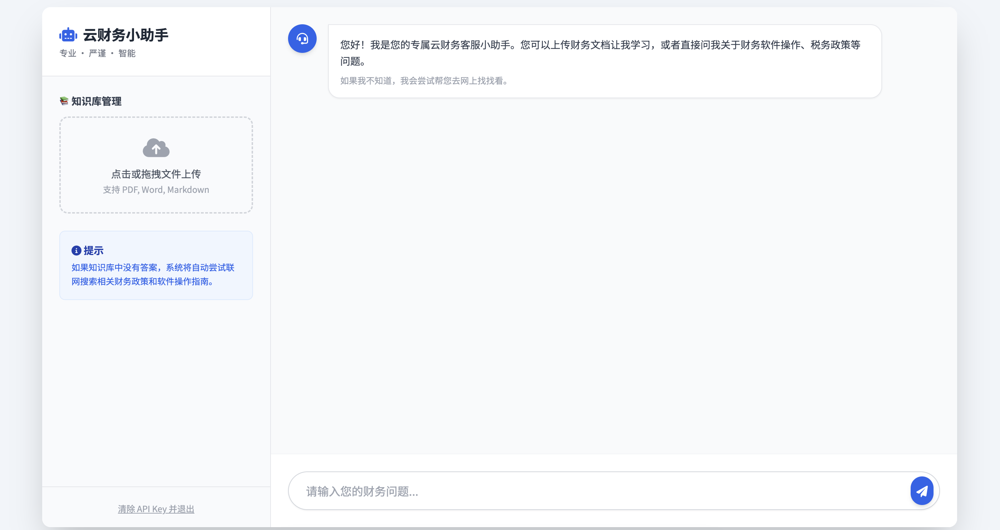

-----

# 🤖 云财务客服小助手 (Cloud Finance AI Assistant)


> 基于 FastAPI + LangChain + 阿里通义千问构建的智能 RAG 问答系统，专为财务领域打造。


## 📖 项目介绍

**云财务客服小助手** 是一个全栈 AI 问答应用。它允许用户上传企业内部的财务文档（PDF, Word, Markdown），通过 RAG（检索增强生成）技术构建本地知识库，并结合阿里通义千问大模型（Qwen-Plus）进行专业解答。

当本地知识库无法回答时，系统会自动进行联网搜索（DuckDuckGo），确保信息的时效性和准确性。

### ✨ 核心功能

* **📚 多模态文档解析**：支持上传 `.pdf`, `.docx`, `.md` 格式的财务文件，自动清洗并建立向量索引。
* **🧠 智能 RAG 检索**：优先检索本地上传的知识库，精准回答企业内部问题。
* **🌐 自动联网补全**：当本地知识库无答案时，自动触发 DuckDuckGo 联网搜索，获取最新的财务政策或软件操作指南。
* **🛡️ 领域强约束**：通过 Prompt Engineering 严格限制模型仅回答“财务、税务、软件操作”相关问题，避免闲聊。
* **🔐 安全鉴权**：API Key 存储在前端 LocalStorage，后端无状态不保存 Key，保障用户资产安全。
* **🎨 现代化 UI**：基于 HTML5 + Tailwind CSS 构建的响应式界面，支持 Markdown 渲染、打字机效果和状态反馈。

## 🛠️ 技术栈

* **后端框架**: FastAPI (Python)
* **AI 编排**: LangChain (LCEL)
* **大模型 (LLM)**: 阿里云 DashScope (通义千问 Qwen-Plus)
* **向量数据库**: ChromaDB (内存模式)
* **搜索引擎**: DuckDuckGo Search
* **前端**: 原生 JavaScript + Tailwind CSS (CDN) + Marked.js

## 🚀 快速开始

### 1. 环境准备

确保您的系统已安装 Python 3.10 或更高版本。

### 2. 克隆项目

```bash
git clone https://github.com/zuoban0823/cw_rag.git
cd cw_rag
```

### 3\. 安装依赖

```bash
pip install -r requirements.txt
```

> **注意**: 如果遇到 `docx2txt` 相关错误，请确保已执行 `pip install docx2txt`。

### 4\. 启动服务

```bash
python main.py
```

或者使用 uvicorn 热重载启动（开发推荐）：

```bash
uvicorn main:app --reload
```

### 5\. 访问应用

打开浏览器访问：[http://127.0.0.1:8000](https://www.google.com/search?q=http://127.0.0.1:8000)

首次访问时，需要输入您的 **阿里云 DashScope API Key** (格式如 `sk-...`) 进行验证。

## 📂 项目结构

```text
cloud-finance-assistant/
├── main.py              # FastAPI 后端主程序 (包含 LangChain 逻辑)
├── requirements.txt     # 项目依赖列表
├── jianli.pdf           # (可选) 默认加载的示例文件
├── templates/
│   └── index.html       # 前端单页应用
└── README.md            # 项目说明文档
```

## 📝 使用指南

1.  **身份验证**: 输入 API Key 进入系统。
2.  **知识库构建**:
      * 点击左侧上传区域。
      * 选择本地的财务手册（PDF/Word）。
      * 点击“开始学习更新”，等待系统提示“学习完成”。
3.  **智能问答**:
      * 在右侧对话框输入问题，例如：“如何导出资产负债表？”。
      * 系统将分析是查阅文档还是联网搜索，并给出带有来源标注的回答。

## ⚠️ 注意事项

  * **API Key**: 本项目使用阿里云 DashScope 服务，产生的 Token 消耗由用户 API Key 对应的账户承担。
  * **数据持久化**: 当前版本使用的是 ChromaDB 的内存模式，**重启服务后，上传的知识库会被清空**，需要重新上传。

## 🤝 贡献

欢迎提交 Issue 或 Pull Request 来改进这个项目！

1.  Fork 本仓库
2.  新建 Feat\_xxx 分支
3.  提交代码
4.  新建 Pull Request

## 📄 开源协议

MIT License

```
```